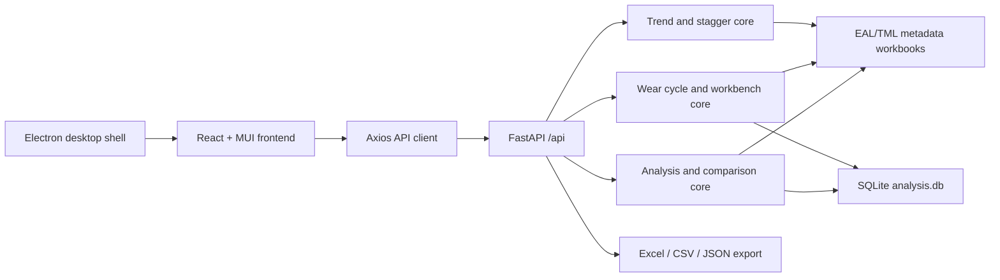
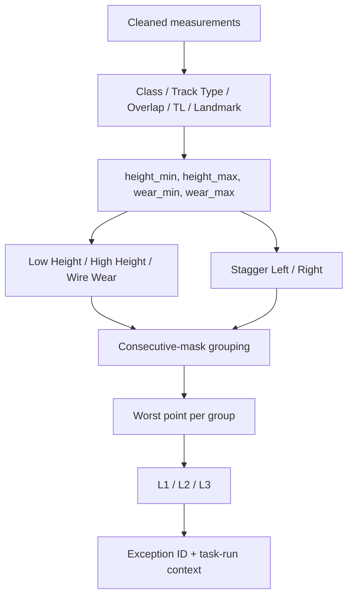
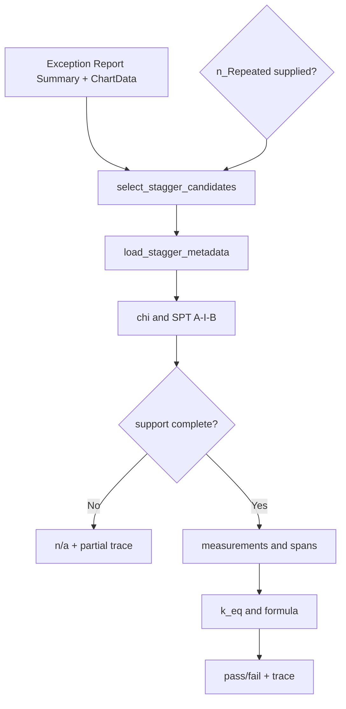

# TOV640 Analyzer 技術架構與演算法設計

最後更新：2026-07-17
對應程式碼：`main` / `3c84b4f4667768eb1c634d0107d93247006517d2`

本文是 TOV640 Analyzer 的主要技術文件，描述目前 runtime 架構、資料與 API 邊界、核心演算法、wire-wear complete-cycle 設計、持久化模型及維護影響。內容以目前 HEAD 為準；Excel metadata 是業務設定來源，但不取代本文件所列的程式合約。

## 1. 文件依據與 Codebase Memory 快照

本次更新先以 codebase-memory-mcp 對 canonical checkout 執行 moderate persistent re-index，再以 `get_architecture`、`search_graph`、`trace_path`、`get_code_snippet`、`query_graph` 與 graph-augmented `search_code` 核對實作。

索引快照：

| 指標 | 數值 |
| --- | ---: |
| Nodes | 4,484 |
| Edges | 13,797 |
| Functions | 1,226 |
| Methods | 411 |
| Classes | 160 |
| Interfaces | 133 |
| Files | 342 |
| Route-shaped nodes | 108 |
| `CALLS` edges | 2,772 |
| `IMPORTS` edges | 762 |
| `TESTS` edges | 915 |

語言分布為 TypeScript 109 files、Python 96 files、HTML 2 files、JavaScript 2 files、CSS 1 file、SQL 1 file。Route-shaped nodes 同時包含 endpoint definitions 與測試中出現的 request URL，因此不能把 108 直接視為 production endpoint 數量。

Graph 的社群偵測顯示主要邏輯群集為：

- backend exception analysis 與 metadata mapping；
- backend wire-wear cycle、repository、workbench 與 sync；
- backend import/export 與 SQLite persistence；
- backend trend 與 stagger calculation；
- frontend exception、history compare、database records；
- frontend `WearCalculatorView`、`WearRecordsPanel` 與 `useWearRecordsStore`。

Graph hotspot 顯示 `DatabaseManager.get_connection` 有 134 個 inbound references，`ExceptionDetector.analyze` 有 25 個 inbound references。`trace_path` 亦確認 `ExceptionDetector.analyze` 由 `analyze_data` 進入，向下連接 metadata mapping、scalar/stagger detection 及 optional persistence；`save_analysis_cycle` 則連接 preview validation、`BEGIN IMMEDIATE`、data version、cycle records、segments 與 conflict audit。

目前索引對最新新增檔案仍有局部 stale/missing symbols，例如 `wear_tl_scope.py` 與新版 React About components 未完整出現在 symbol graph。遇到此情況，本文件以 HEAD 原始碼為最終依據；graph 只用於補充架構關係、hotspot 與維護影響，不用過期 symbol 覆蓋實際程式碼。

## 2. 系統總覽

TOV640 Analyzer 是供接觸網維修人員使用的 Windows desktop 分析工具。它把 `.datac` 原始量測、EAL/TML metadata workbooks、Exception Reports、n_Repeated Reports 與 SQLite 紀錄串接成下列工作流：

- Height、Wire Wear、Stagger exception detection；
- 多期 Exception Report repeated-chain compare；
- repeated records 保存、匯入、匯出及 workflow 更新；
- 365 日內已驗證紀錄檢查；
- wire-wear complete-cycle 預覽、coverage、conflict audit 與保存；
- wire-wear staged add/edit/delete workbench；
- all-history dashboard、trend rate 與 threshold projection；
- Wire Wear L2 trend recommendation；
- Stagger support/span 計算與 trace；
- Exception Report、Repeated Report、Catenary CSV、wear workbook 與 sync package 匯出。

主要技術棧：

- Electron 25：desktop shell、backend process lifecycle、file dialog IPC；
- React、Vite、MUI：operational UI；
- Zustand：tab-scoped workflow 與 staged state；
- Axios：frontend API boundary；
- FastAPI、Pydantic：HTTP API；
- pandas、NumPy、openpyxl：dataframe、regression、Excel parsing/export；
- SQLite：analysis、repeated records、normalized wear cycles、sync/versioning；
- PyInstaller、electron-builder：portable Windows packaging。



## 3. Runtime 分層架構

### 3.1 Electron Desktop Shell

主要檔案：

- `electron/main.js`
- `electron/preload.js`

啟動流程：

1. Development 使用 `venv/Scripts/python.exe -m uvicorn app.main:app`；packaged mode 啟動 `resources/backend/backend_server.exe`。
2. Backend 只綁定 `127.0.0.1:8000`。
3. Electron 每 500 ms 輪詢 `GET /api/health`，最多等待 30 秒。
4. Backend ready 後才建立 `BrowserWindow`。
5. Development 載入 `http://localhost:5173`；packaged mode 載入 `frontend/dist/index.html`。
6. App quit 時終止 Python process。

Browser window 使用 `contextIsolation: true`、`nodeIntegration: false`。Preload 只暴露：

- `electronAPI.openFile()`；
- `electronAPI.saveFile(data, defaultName)`。

About guide 已不再透過 Electron IPC 或 iframe 載入 HTML；runtime source 是 React components。舊 HTML 只保留為歷史 artifact。

Packaged mode 由 Electron 設定：

- `CONFIG_PATH=<resources>/config`；
- `DB_PATH=<packaged app root>/data/analysis.db`。

### 3.2 Frontend Presentation 與 State

主要邊界：

- `frontend/src/App.tsx`：view selection；
- `frontend/src/components/Layout/MainLayout.tsx`：navigation、responsive drawer、light/dark theme；
- `frontend/src/views/*`：workflow composition；
- `frontend/src/components/*`：tables、charts、dialogs、status panels；
- `frontend/src/store/*`：Zustand workflow state；
- `frontend/src/api/client.ts`：wire contract 與 UI contract mapping；
- `frontend/src/types/api.ts`：TypeScript API types。

App 預設開啟 About view。主要 views：

| View | 工作流 | State owner |
| --- | --- | --- |
| `ExceptionGeneratorView` | `.datac` analysis、chart/table、export | `useAnalysisStore` |
| `HistoryCompareView` | repeated-chain compare | `useHistoryStore` |
| `DatabaseRecordView` | repeated records CRUD、1 Year、import/export | `useDatabaseStore` |
| `MetadataEditorView` | workbook sheet read/write | local state + API |
| `WearCalculatorView` | cycle analysis、records、dashboard、projection | `useWearStore` + `useWearRecordsStore` |
| `TrendAnalyzerView` | Wire Wear L2 trend | `useTrendStore` |
| `CalculationView` | Stagger calculation | `useCalculationStore` |
| `AboutView` | 操作指南、開發者參考、runtime diagnostics | local state + diagnostics API |

`useWearStore` 按 calculation tab 保存 uploaded files、line、cycle date、accepted conflicts、preview、save result 與 loading/error state。每個 tab 的 async preview/save 都有 request identity guard，避免切換或關閉 tab 後舊 response 覆蓋新 state。

`useWearRecordsStore` 保存 committed workbench snapshot 與 staged operations，並從 snapshot 派生 optimistic matrix、pending summary 及 navigation guard。未提交的 add/edit/delete 不會直接寫 DB。

### 3.3 FastAPI Layer

`backend/app/main.py` 掛載七個 routers，全部置於 `/api`：

| Router | Prefix / 代表路由 | 職責 |
| --- | --- | --- |
| `analysis.py` | `/analyze`, `/analyze/compare`, `/export/*` | exception analysis、compare、legacy/cache export |
| `metadata.py` | `/metadata/{filename}` | workbook sheets、validation、atomic save |
| `sessions.py` | `/sessions*`, `/exceptions/{id}/status` | analysis sessions 與 exception workflow |
| `database_records.py` | `/database/repeated-records*` | repeated records CRUD、1 Year、Excel import/export |
| `calculation.py` | `/calculation/health`, `/wear`, `/upload`, `/trend`, `/stagger` | calculation upload endpoints、complete-cycle preview |
| `wear_records.py` | `/calculation/wear-records*` | cycle save、staged changes、workbench、analytics、sync |
| `diagnostics.py` | `/diagnostics` | DB/config path、portable/packaging diagnostics |

Middleware：

- local desktop model 允許 CORS all origins/methods/headers；
- responses 大於 1,000 bytes 使用 GZip；
- `Content-Disposition` 暴露給 frontend download handling。

### 3.4 Core Domain Modules

| 模組 | 核心責任 |
| --- | --- |
| `data_ingestion.py` | `.datac` parsing、column normalization、Chainage、invalid-value cleanup |
| `metadata.py` | boundary、threshold、track、overlap、landmark、TL source rows |
| `metadata_service.py` | metadata API validation、backup、atomic workbook save |
| `analyzers.py` | metadata enrichment、threshold detection、grouping、exception ID |
| `repeated_finder.py` | report normalization、interval/peak repeated matching |
| `database.py` | SQLite singleton、schema/migration、analysis/repeated persistence |
| `exporter.py` | exception、compare、raw/catenary export |
| `calculation/excel_parser.py` | Summary、ChartData、Wire Wear、n_Repeated parsing |
| `calculation/wear_calculator.py` | wear statistics 與 wear percentage |
| `calculation/wear_tl_scope.py` | line-specific MAINLINE/SIDING/UNKNOWN classifier |
| `calculation/wear_cycle_metadata.py` | metadata normalization、resolution index、Section transition、coverage |
| `calculation/wear_cycle_aggregation.py` | deterministic preview、identity/conflict、aggregation、digest |
| `calculation/wear_cycle_repository.py` | atomic save、staged changes、workbench、optimistic concurrency |
| `calculation/wear_cycle_analytics.py` | all-history rate、dashboard、projection |
| `calculation/wear_cycle_io.py` | cycle Excel、stable sync schema、preview/apply |
| `calculation/wear_records.py` | legacy wear table、compatibility workbench/export/sync |
| `calculation/trend_analyzer.py` | L2 trend regression 與 recommendation |
| `calculation/stagger_*` | candidate、metadata、support、measurement、`k_eq`、formula、trace |

### 3.5 Persistence Layer

SQLite schema 的主要資料表：

| 類別 | Tables |
| --- | --- |
| Analysis | `analysis_sessions`, `exceptions`, `exception_history`, `reports` |
| Repeated records | `saved_repeated_exceptions` |
| System | `system_metadata`, `schema_migrations` |
| Legacy wear | `wire_wear_records` |
| Normalized wear | `wire_wear_cycles`, `wire_wear_cycle_segments`, `wire_wear_cycle_records`, `wire_wear_conflict_decisions`, `wire_wear_deletion_tombstones` |

Normalized wear 的 business keys：

- cycle：`(line_group, cycle_date)`；
- record：`(line_group, cycle_date, tension_length)`；
- segment：`(cycle_id, segment_name)`；
- conflict decision：`(cycle_id, measurement_identity)`；
- tombstone：`(line_group, cycle_date, tension_length)`。

`wire_wear_cycle_records.physical_intervals` 與 `source_lineage` 使用 JSON text，保留 canonical split geometry 與來源追蹤。`system_metadata.wire_wear_data_version` 是 cycle save 與 sync 的 optimistic version；每個成功 transaction 只遞增一次。

DB path 優先序：

1. `DB_PATH` environment variable；
2. frozen portable mode 的 external `data/analysis.db`；
3. `%APPDATA%/TOV640_Analyzer/data/analysis.db`。

Config path 優先序：

1. `CONFIG_PATH` environment variable；
2. frozen executable-relative `config`；
3. PyInstaller `_MEIPASS/config`；
4. development repository `config`。

## 4. Exception Analysis 演算法

### 4.1 Data Ingestion

`DataLoader.load_data`：

1. 讀取 `.datac` 成 DataFrame；
2. 標準化欄位並移除 header/footer/noise rows；
3. 將量測欄位轉為 numeric；
4. 將 wear sentinel `6.56` 視為無效；
5. 由 `KM + LOCATION` 建立 `Chainage`；
6. 將 `height1..height4` 加 5300，換算實際高度。

常用欄位：`STG1c..4c -> stagger1..4`、`RWH1mm..4mm -> wear1..4`、`WHGT1c..4c -> height1..4`、`LINE -> Line`、`TRACK -> Track`。

### 4.2 Metadata Mapping

`MetadataManager` 讀取 `Exception Boundarys`、threshold、track type、overlap、tension length 與 landmark。Threshold long form 由 `_normalize_thresholds()` 轉成 detector 的 wide form。

`ExceptionDetector._apply_mapping` 以 Chainage 對 interval metadata；重疊時較短 interval 優先。實作包含 pandas/NumPy fast paths、`intervaltree` fallback 與 slow-loop fallback。

### 4.3 Detection Pipeline

Codebase Memory inbound trace：`analyze_data -> ExceptionDetector.analyze`。`analyze` 再呼叫 `_map_class_info`、`_map_track_info`、`get_all_thresholds`、`_detect_scalar`、`_detect_stagger`，並只在 `auto_save=True` 且提供 `db_manager` 時呼叫 `_save_to_database`。現行 `POST /api/analyze` 未傳 `auto_save=True`，主要輸出留在 response/frontend/export cache。



| Type | Aggregate | 趨勢 | Levels |
| --- | --- | --- | --- |
| Low Height | `height_min` | 越低越嚴重 | L1/L2 |
| High Height | `height_max` | 越高越嚴重 | L1/L2 |
| Wire Wear | `wear_min` | 越低越嚴重 | L1/L2 |
| Stagger Left | `stg_max` | 正向偏移越大越嚴重 | L1/L2/L3 |
| Stagger Right | `stg_min` | 負向偏移越大越嚴重 | L1/L2/L3 |

Scalar gatekeeper：min mode 使用可用 threshold 的較大值；max mode 使用可用 threshold 的較小值。Blank/missing/NaN levels 不參與 gatekeeper 或 level classification。若 Wire Wear 只有 L1，系統只產生 L1，不虛構 L2。

Exception ID：

- task/station 三欄完整：`{date}_{line}_{task_no}_{station_start}-{station_end}_{code}{counter}`；
- 任一欄缺失：`{date}_{line}_{track}_{section}_{code}{counter}`。

## 5. History Compare 與 1 Year

### 5.1 Repeated Chain

報表依檔名中的 8 位日期由新至舊排序。最新報表作為 accumulator，逐份與舊報表比對；每輪只讓持續命中的 exception 進入下一輪，並新增 `Previous 1..N` context。

Match 條件：

1. exception type 相同；
2. 新舊 interval 有交集；
3. 新 peak `maxLocation` 在交集內；
4. 舊 peak `maxLocation` 也在交集內；
5. 同一最新 exception 有多個舊 match 時保留第一個 deterministic match。

Parser 同時接受 legacy/display aliases，例如 `startM/FromM`、`endM/ToM`、`ID/id`、`Exception Type/exception type`、`MaxValue/maxValue`。

### 5.2 Check 1 Year

`POST /api/database/repeated-records/check-1-year` 以 line、track、section、exception type、location interval 與 365 日視窗比對 current exceptions 與 SQLite records。

日期優先序：current 使用 `task_run_date -> date_str -> request current_date`；DB record 使用 `task_run_date -> date_str`。命中時 action 改為 `No action required (Verified within 1 year)`，並把 current exception ID 加到 matched record 的 `reoccurrence_id`。因此這是會 commit 的 workflow，不是純查詢。

## 6. Wire-Wear Complete-Cycle 演算法

### 6.1 入口與 Expected Segments

Preview 使用 `POST /api/calculation/wear` 的 complete-cycle branch；save 使用 `POST /api/calculation/wear-records/cycles`。Frontend `useWearStore.previewCycle()` 與 `saveCycle()` 使用同一批 frozen `File` objects、accepted conflict IDs、cycle date 與 preview digest。

Expected segment order：

- EAL：`U1, U2, U3, D1, D2, D3, LOW S1, RAC UP, RAC DN, LMC UP, LMC DN`；
- TML：`U1, U2, U3, U4, U5, D1, D2, D3, D4, D5`。

Filename aliases 只負責把來源檔案宣告為一個或多個 expected segments；它們不取代 report 內的 line、track、Section、Chainage 或 TL identity。

### 6.2 TL Scope Classifier

`classify_tension_length_scope(line_group, tension_length)` 回傳 `MAINLINE`、`SIDING` 或 `UNKNOWN`。分類是 line-specific、identity/series-based；不可以只看 canonical `Track`。

| Line | MAINLINE | SIDING |
| --- | --- | --- |
| EAL | `H1..H52`, `D1..D31`, `U1..U55`, `K1..K16`, `L1..L20`, numeric `1..76`, approved `Ubase/suffix`, exact `H23D`, `H26D`, `69B`, `70A`, `T2`, `T3`, `X36`, `X37`, `X50`, `X53`, `X54` | `HX2`, `EM1`, `D32`, `D33`, `LX<positive>`, `X1..X39`（exact mainline exceptions 先判）、`Neutral Section` |
| TML | `M1..M33`, `D1..D60`, `U1..U55`, `K1..K16`, numeric `1..74`, approved `Ubase/suffix` | `MX1..MX11`, `MD1..MD22`, `PT1..PT2`, `CT1..CT3`, `KX1..KX7`, `X1..X29`, `MP24`, `EM1`, `W1-1`, `27A`, `101..103`, `Neutral Section` |

Approved slash variants 的 base 為 `7, 8, 31, 36`，suffix 為 `1, 2`，允許 base 的 leading zero。Classifier 只決定 scope，不改寫 canonical/display TL value。

處理規則：

- `SIDING`：正常排除，不進 results、conflicts、coverage numerator/denominator、Expected TLs、Diagnostic Gaps、save 或 export；
- `UNKNOWN`：fail closed，加入 actionable unresolved diagnostics 並阻擋保存；
- `MAINLINE`：即使 canonical Track 因跨方向 interval 合併為 `Siding`，仍保留。

### 6.3 Metadata Load 與 Composite Source Signature

Metadata source sheets：

- EAL：`EAL UP/DN`, `RAC UP/DN`, `LOW S1`, `LMC UP/DN`；
- TML：`TML UP/DN`。

每個 source row 保留：

- ordered `source_tension_lengths`；
- `source_priority`；
- `source_from_m/source_to_m`；
- sheet、Section、source row number。

Composite TL cell 以原始 from/to 方向與 ordered TL count 等分成 physical intervals；source signature 與 row bounds 仍保留，不能把 `23,25` 壓平成無序集合，也不能只保留 canonical TL。

### 6.4 Section-Aware Measurement Resolution

`resolve_measurement_tension_length` 的嚴格流程：

1. 正規化 line、UP/DN track、Section、原始 Chainage 及 ordered raw TL candidates；
2. 查 preview-level `MeasurementResolutionIndex`；
3. strict match 必須同 Section、同 track，且原始 Chainage 落在原 source-row bounds；
4. 若 strict match 已存在，直接做 primary TL 判定，不執行 transition；
5. 只有 strict Section gap 才可嘗試 constrained transition；
6. transition 仍要求同 line、同 track、同原始 Chainage、完全相同的 ordered composite source signature；
7. transition matches 必須只對應一個唯一 source row（sheet、Section、row number、bounds、signature）；
8. 取最小 `source_priority` 的 primary TL，且必須唯一；否則回傳 HTTP 422。

明確禁止：

- transform Chainage；
- widening interval；
- nearest interval；
- 無條件 Mainline fallback；
- 忽略 Section；
- 把 composite signature 排序或去除來源身份；
- 多個 source rows 或 primary TL 時自動猜測。

### 6.5 Canonical Geometry

`resolve_canonical_tl` 收集同 TL 的 metadata intervals，以 0.01 m tolerance 合併相接或重疊範圍。gap 大於 tolerance 時保留為不同 `PhysicalInterval`；record 的 `from_m/to_m` 是整體 bounding range，`physical_intervals` 才是實際幾何。

- 所有 intervals 同方向時 canonical Track 為 UP 或 DN；
- 跨方向或同一 merged interval 混合方向時 canonical Track 為 `Siding`；
- canonical Track 是摘要，不是 TL scope classifier；
- Analysis 的方向篩選使用 physical intervals，相容 track 包括 required direction 及 `Siding`，不再用 UI 的 Siding filter 刪除合法 mainline records。

### 6.6 Measurement Identity 與 Conflict

優先使用 `stable_measurement_id`。沒有 stable ID 時，fallback identity 由以下欄位 deterministic 組成：

`line + declared segment signature + track + acquisition date + task_no + station_start + station_end + exact decimal Chainage`

同 identity 若來源值不同：

1. 系統選較低的 `wear_min` 作保守值；
2. 以 identity + sorted source/value pairs 建立 SHA-256 `conflict_id`；
3. preview 顯示所有來源值；
4. 未接受 conflict 時 `conflict_not_accepted` 阻擋保存；
5. save 後在 `wire_wear_conflict_decisions` 留 audit record。

### 6.7 Aggregation 與 Wear Percentage

每個 MAINLINE TL 對 accepted measurements 計算 arithmetic mean 與 sample SD，再用 wire geometry 計算 wear percentage：

```text
R = 6.6
A_total = 120.0
theta = acos((r - R) / R)
worn_area = theta * R^2 - R * sin(theta) * (r - R)
wear_percentage = clamp(worn_area / A_total * 100, 0, 100)
```

Cycle date 使用使用者提供的 strict ISO `YYYY-MM-DD`；若未提供則取 accepted acquisition dates 的最大值。無法建立日期時 `cycle_date_invalid` 阻擋保存。

### 6.8 MAINLINE-Only Coverage

Coverage denominator 只由 classifier 判定為 MAINLINE 的 canonical TL 組成，再依 expected segment 的 physical direction 與來源 chainage range 篩選。Numerator 只計算該 segment 實際量到且能 canonical resolve 的 MAINLINE TL。

```text
coverage_percentage = round(100 * |numerator| / |denominator|, 2)
diagnostic_gaps = denominator - numerator
```

特殊狀態：

- 沒有來源檔：`segment_missing`；
- metadata denominator 為空：`metadata_denominator_empty`；
- 其餘 Diagnostic Gaps 只列 MAINLINE TL identity。

SIDING TL 不會污染 Cycle Coverage、Expected TLs、Diagnostic Gaps 或 Excel export。

### 6.9 Blocking、Digest 與 Save

Preview blocking reasons：

- `cycle_date_invalid`；
- `segment_missing`；
- `unknown_segment`；
- `unresolved_tension_length`；
- `conflict_not_accepted`。

`preview_digest` 對完整 preview content 做 stable SHA-256，但排除 `generated_at`。Save endpoint 會用同一批 files 重新 build preview，要求 rebuilt digest 等於 supplied digest；不一致回 HTTP 409。接著 `save_analysis_cycle` 在 `BEGIN IMMEDIATE` transaction 內：

1. 驗證 `can_save`、records、unique business keys、accepted conflicts；
2. 驗證 `expected_data_version`；
3. 寫 cycle、segments、records、conflict decisions；
4. 遞增 `wire_wear_data_version`；
5. 任一步失敗即 rollback。

## 7. Wire-Wear Records Workbench

### 7.1 Read Model

`GET /api/calculation/wear-records/workbench` 由 normalized cycle tables 建立：

- date x TL historical matrix；
- aligned latest summary；
- per-TL historical SD；
- metadata catalog 與 physical intervals；
- `wire_wear_data_version`。

Response 暫時合併 legacy `build_workbench_summary` keys，讓舊 clients 漸進轉移。`wire_wear_records` legacy table 與 normalized cycle tables 是兩個不同 persistence model，新功能以 normalized tables 為準。

### 7.2 Staged Operations

Frontend 支援四種 operations：

- `add`：business key + `avg_wear_min`；
- `edit`：business key + new value + `expected_updated_at`；
- `delete_cell`：business key + `expected_updated_at`；
- `delete_row`：line group + cycle date。

UI 先從 committed snapshot 派生 optimistic state，以橙色 staged treatments、icons、繁中 labels、legend 與 pending summary 表示尚未提交的改動。切離 Records tab 時，navigation guard 要求 Save、Discard 或 Cancel。

`apply_change_set` 在單一 `BEGIN IMMEDIATE` transaction 依序執行。Edit/Delete Cell 以 `expected_updated_at` 做 row-level optimistic concurrency；任何 operation 失敗會回報 operation index 並 rollback 整批。Delete 會寫 tombstone，孤立 cycle parent 才會被刪除。成功後只遞增一次 data version。

## 8. Dashboard、Projection 與 Sync

### 8.1 All-History Trend

`fit_tl_trend` 先把同一天的 TL records 平均，再以首日為 x=0，將 elapsed days 除以 365.2425，對 remaining thickness 做 linear regression。

- 少於兩個日期：`insufficient_data`；
- thickness slope >= 0，即 wear rate <= 0：`non_positive_rate`；
- 其他：`eligible`，`mm_per_year = -slope`，並計算 wear-percent/year 與 `R²`。

Dashboard 提供 top maximum wear rate、top minimum positive wear rate 與 highest current wear。

Projection 要求 `0 < threshold_mm <= 13.2`，預設 horizon 30 年。每個 TL 分為 already at threshold、insufficient data、non-positive rate，或以 regression crossing date 放入年度 bucket。

### 8.2 Stable Sync

Normalized sync schema 為 `wear-cycle-v1`，包含 package metadata、cycles、records、segments、conflict decisions 與 tombstones。流程為：

1. export canonical package + metadata fingerprints；
2. import preview 驗證 schema、business keys、timestamps、geometry、metadata fingerprint；
3. 以 record/tombstone timestamp 決定 create/update/delete/unchanged/conflict/error；
4. 產生 actions + expected data version 的 preview digest；
5. apply 時重建 preview、核對 digest/version，再以 `BEGIN IMMEDIATE` 原子套用。

Local canonical metadata 永遠是 authority。Fingerprint 不同時會 warning；若 canonical geometry 亦改變，該 key 轉為 error，不靜默接受 remote geometry。Record 與 tombstone 同 timestamp 時 tombstone 勝出。

## 9. 其他 Calculation 演算法

### 9.1 Legacy Average Wear

`calculate_average_wear` 與 legacy `/calculation/upload` 仍供 compatibility 使用。它們依 ChartData、optional TL lookup 與 `wear_min` 做平均；若跨方向，output track 可為 `Siding`。新的 complete-cycle workflow 不應繞過 classifier、Section-aware resolution、coverage、digest 或 normalized repository。

### 9.2 Wire Wear L2 Trend

只分析最新週期、`level == L2`、action 空白的 Wire Wear records。有 n_Repeated file 時，ID 必須出現在 repeated summary；Case B 不 fallback 至全部 candidates。

每個日期取 exception interval 內最小 `wear_min`，按日期做 linear regression。現行常數：`L2_THRESHOLD = 10.2`、`TOLERANCE = 0.2`。

| 條件 | Recommendation |
| --- | --- |
| fitted value > 10.2 | `no action required` |
| fitted value <= 10.2 且與最新實測差 > 0.2 | `verify on site` |
| fitted value <= 10.2 且差 <= 0.2 | `confirmed valid L2` |

`trend_next` 目前是最新日期的 fitted value，即 `trend_points[0]`，不是下一週期外推。

### 9.3 Stagger Calculation



Case A 從 Summary 選 L1/L2 Stagger Left/Right；Case B 只保留 n_Repeated 中同 ID records，並可用 repeated `max_location` 定位。Case B 無 match 時回 warnings 與空結果，不 fallback Case A。

缺必要 support point 時：`overall_result = n/a`、`trace_status = partial`、`trace_available = true`。

## 10. API 與資料契約摘要

### 10.1 主要 API

| Workflow | Method / Path | 主要 contract |
| --- | --- | --- |
| Analysis | `POST /api/analyze` | params、exceptions、boundaries、column-oriented chart_data |
| Compare | `POST /api/analyze/compare` | repeated、stats、chain_order、chart_data |
| Complete-cycle preview | `POST /api/calculation/wear` | records、segments、conflicts、blocking、digest、expected version |
| Complete-cycle save | `POST /api/calculation/wear-records/cycles` | same files + digest + expected version |
| Staged changes | `POST /api/calculation/wear-records/changes` | ordered add/edit/delete operations |
| Workbench | `GET /api/calculation/wear-records/workbench` | matrix、latest summary、catalog、version |
| Cycle Excel | `GET /api/calculation/wear-records/export.xlsx` | MAINLINE records/coverage/diagnostics/audit |
| Cycle sync | `/sync.json`, `/sync/preview`, `/sync/apply` | `wear-cycle-v1` deterministic sync |
| Dashboard | `GET /api/calculation/wear-records/dashboard` | all-history ranked summaries |
| Projection | `GET /api/calculation/wear-records/projection` | threshold crossing buckets |
| Diagnostics | `GET /api/diagnostics` | runtime DB/config/packaging paths |

### 10.2 Naming Boundary

| Layer | Style | Examples |
| --- | --- | --- |
| Backend/DB canonical | `snake_case` | `exception_id`, `from_m`, `physical_intervals` |
| Legacy analysis/display | mixed aliases | `id`, `FromM`, `maxValue`, `exception type` |
| Excel | spaced/Pascal headers | `Exception Type`, `MaxLocation` |
| Frontend | camelCase UI model + mapped wire aliases | `lineGroup`, `cycleDate`, `previewDigest` |

API client 是 snake_case wire contract 與 camelCase UI contract 的唯一主要 mapping boundary。新增欄位時不可只改 TypeScript interface 或 backend response 其中一側。

### 10.3 Normalized Wear Record

核心欄位：

- business key：`line_group`, `cycle_date`, `tension_length`；
- geometry：`track`, `from_m`, `to_m`, `physical_intervals`；
- statistics：`avg_wear_min`, `wear_percentage`, `measurement_sd`；
- audit：`source_lineage`, `created_at`, `updated_at`。

`track == Siding` 只表示 canonical geometry 跨方向或混合；不能推論 scope 是 SIDING。

## 11. About 與內建指南

Runtime About source：

- `frontend/src/views/AboutView.tsx`；
- `frontend/src/components/About/AboutGuideTabs.tsx`；
- `OperatorGuide.tsx`；
- `DeveloperReference.tsx`；
- `GuideVisuals.tsx`；
- `aboutGuideContent.ts`；
- `DiagnosticsPanel.tsx`。

預設 tab 是「操作指南」，另一 tab 是「開發者參考」。內容涵蓋工作流程、threshold、repeat、1 Year、wear resolution/coverage、trend/stagger、staged changes、架構、API/state ownership、contracts、diagnostics 與 verification layers。`AboutView` 直接呼叫 `/api/diagnostics`；不使用 iframe，也不依賴 legacy HTML 才能顯示。

## 12. 關鍵設計決策與限制

1. Metadata workbooks 是 domain configuration source of truth，但 unknown/ambiguous metadata 必須 fail closed。
2. TL scope 與 canonical Track 是兩個獨立概念。
3. Section transition 是 strict gap 的受限例外，不是 fallback search strategy。
4. Chainage 與 source signature 是 identity contract，不可近似匹配。
5. Preview/save 與 sync 都採 rebuild + digest + version，不信任過期 frontend payload。
6. Staged workbench 採 committed snapshot + optimistic derived state；失敗時保留 pending changes。
7. Delete 透過 tombstone 參與跨 workstation sync。
8. Analysis router 仍有 module-level `LAST_*` cache；GET export 適合單使用者 desktop 流程，多-tab 安全匯出應使用 POST generate 或 normalized cycle export。
9. Legacy `wire_wear_records` 尚未移除；維護時要明確分辨 legacy CRUD 與 normalized cycle repository。
10. Legacy field aliases 是外部報表相容契約，不應在無 migration 計畫時直接正規化掉。

## 13. 維護與影響分析

Codebase Memory 的 trace 與 co-change graph 指出以下高影響範圍：

| 修改類型 | 必查範圍 |
| --- | --- |
| Exception detection | `analyzers.py`, `metadata.py`, analysis API、exporter、backend tests、Exception UI |
| TL identity/scope | `wear_tl_scope.py`, metadata loader/resolver、aggregation、coverage、IO/export、sync、real-file tests |
| Section/geometry | `wear_cycle_metadata.py`, cycle types、repository、metadata preview、frontend detail/records tables |
| Preview/save contract | aggregation digest、calculation API、wear-records API、`useWearStore`、API mappings/types |
| Staged operations | repository、tombstones、wear-records API、`useWearRecordsStore`、dialog/tables/navigation guard |
| Dashboard/projection | cycle analytics、repository read order、API client/types、dashboard/projection panels |
| Sync schema | cycle IO、metadata fingerprints、repository version/tombstones、sync endpoints/tests |
| DB schema | `schema.sql`, `database.py` migrations、repository、exports、fixture/setup tests |
| About/guide | About components、guide content、diagnostics API、responsive/light-dark tests |

Graph 的 `FILE_CHANGES_WITH` 顯示本文件歷史上常與 `docs/algorithm.md`、`docs/field-mapping-spec.md` 及 detection tests 一起變更。這是維護提示，不代表應自動修改或還原使用者已刪除的文件。

修改 production symbol 前必須重新 index current worktree、`search_graph` 定位、`trace_path(direction="inbound")` 做 impact analysis；HIGH/CRITICAL symbol 應先告知風險，再改 code 與相應測試。新增、移動或刪除 production code 後要再次 re-index，因 `index_status: ready` 不代表 index 已包含最新檔案。

## 14. 驗證策略

- Backend unit/API：classifier collision、metadata resolution、coverage、aggregation、repository transaction、sync、analytics、exception/repeat/trend/stagger；
- Real-file regression：EAL Mainline/RAC/LOW S1/LMC、TML complete cycle；
- Frontend Vitest：stores、API mapping、staged add/edit/delete、navigation guard、About components；
- Static/build：ESLint、TypeScript、Vite production build；
- Browser workflow：canonical `npm run dev`、real uploads、light/dark、desktop/mobile、keyboard/focus、screenshots；
- Packaging：Electron health/startup、portable DB/config paths、file save IPC。

缺失或使用者刪除的 fixtures 應記錄為 unavailable，不應為了讓測試綠燈而自行還原。

## 15. 相關文件

- `docs/algorithm.md`：演算法入口導覽；
- `docs/field-mapping-spec.md`：欄位 mapping 導覽；
- `docs/superpowers/specs/2026-07-16-wear-mainline-resolution-and-visual-guides-design.md`：最新 wear mainline 與 guide approved design；
- `docs/superpowers/plans/2026-07-16-wear-mainline-resolution-and-visual-guides-implementation.md`：對應實作計畫；
- `docs/tov640-analyzer-visual-guide.html`：legacy visual artifact，已不是 runtime source。
