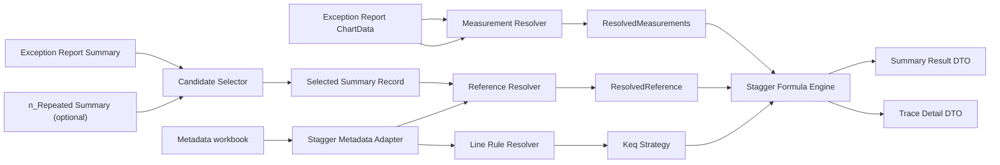

# Stagger Calculation 設計稿

> 狀態：已納入 2026-05-05 最新 finding。此版本明確將問題拆成兩部分：`每個參數怎樣找 / lookup / 計算`，以及 `Support Database / Wind Speed Factor 應怎樣存進 Metadata 而不影響現有功能`。

## 1. 目標

建立新的 `Stagger Calculation` 模組，讓系統可以從：

- `Exception Report.xlsx`
- `n_Repeated Exception Report.xlsx`（可選）

自動篩選需要分析的 `Stagger` exception，並輸出：

1. **UI 主表結果**：每個被篩選出的 `Summary ID` 一筆結果
2. **展開明細**：當用家按需要查看時，顯示 AI / IB 中間計算、`K_eq` 組成、參數來源與 rule-based remark

此模組的目標不是照抄 Excel sheet 結構，而是把 workbook 資料來源拆成三類後，重建與 Excel 對齊的邏輯：

- `Summary`
- `ChartData`
- `Metadata`

## 2. 核心設計原則

### 2.1 Summary / ChartData / Metadata 三分

新程式不應直接依賴 Excel sheet 版面，而應將輸入分成：

- `Summary`：候選 ID、主表欄位、`Ch_I` 主來源
- `ChartData`：`Hgt*` / `Stg*` 量測值與 chainage 對應
- `Metadata`：Support database、Wind Speed Factor、常數與 line-specific strategy

### 2.2 Summary-first + trace-on-demand

這個功能不是任意 chainage calculator，而是：

1. 先決定哪些 `Summary ID` 要分析
2. 再為每個 `ID` 解出 `Ch_I / Spt_I / Spt_A / Spt_B`
3. 再按 line-specific strategy 與公式算出主結果
4. 明細只在需要時展開

因此架構必須以 `Summary ID` 為中心，而不是以 calculation point 為中心。

### 2.3 不破壞現有 public behavior

新增 stagger calculation 時，不能改變既有功能的對外契約，特別是：

- `MetadataManager.get_tension_length_lookup()`
- `get_overlap_intervals()`
- `get_track_type_intervals()`
- `parse_exception_report()`
- `upload_wear()`
- `upload_trend()`

新功能必須走自己的 adapter / service，重用底層能力，但不把 stagger 特例硬塞進既有共用流程。

## 3. 核心需求整理

### 3.1 Function 1：候選 ID 篩選

#### Case A：沒有 `n_Repeated` 檔案

從 `Exception Report` 的 `Summary` 篩選：

- `Level = L1 or L2`
- `Exception Type = Stagger Left or Stagger Right`

得到候選 `ID`

#### Case B：有 `n_Repeated` 檔案

只分析同時出現在 `n_Repeated` 的 `Summary` 中，且符合以下條件的 `ID`：

- `Level = L1 or L2`
- `Exception Type = Stagger Left or Stagger Right`

### 3.2 Function 2：`Ch_I` 決定規則

#### Case A

- `Ch_I = Exception Report Summary.MaxLocation`

#### Case B

- `Ch_I = n_Repeated Report Summary.MaxLocation`

### 3.3 Function 3：`Spt_I` 自動對應

- `Spt_I` 由 `Support database` 中與 `Ch_I` 最接近的 `Chainage` 自動取得

## 4. 參數來源、lookup 與公式規則

### 4.1 基本識別欄位

#### `Track`

來源：

- `Summary`
- `ChartData`（fallback）

規則：

1. 主來源使用 `Summary`
2. 若 `Summary` 缺值，fallback 到 `ChartData`
3. 統一 normalize 成 `up` / `down`

#### `Tension Length`

來源：

- `Summary`

規則：

- 主結果直接保留 `Summary` 的值，不重新 lookup

### 4.2 Chainage / Support related

#### `Ch_I`

規則：

- Case A：`Ch_I = Exception Report Summary.MaxLocation`
- Case B：`Ch_I = n_Repeated Summary.MaxLocation`

#### `Spt_I`

來源：

- `Metadata` 的 `Support database`

規則：

- 在該 `line + track (+ section，如有需要)` 的 support chainage 清單中
- 找與 `Ch_I` 絕對差最小的 support

公式：

```text
SptI = nearest(ChI, support_chainages)
```

#### `Spt_A`

來源：

- `Support database`

規則：

- `Spt_A = Spt_I` 前一個 support chainage

#### `Spt_B`

來源：

- `Support database`

規則：

- `Spt_B = Spt_I` 後一個 support chainage

#### `Span_AI`

公式：

```text
SpanAI = abs(SptA - SptI)
```

#### `Span_IB`

公式：

```text
SpanIB = abs(SptI - SptB)
```

#### `Ch_A`

設計規則：

- 若需要對齊 Excel 命名，可定義為 `Ch_A = Ch_I - Span_AI`
- 但程式內部不必把 `Ch_A` 當主存欄位；它可由 `Spt_A / Spt_I` 推導

#### `Ch_B`

設計規則：

- 若需要對齊 Excel 命名，可定義為 `Ch_B = Ch_I + Span_IB`
- 但程式內部不必把 `Ch_B` 當主存欄位；它可由 `Spt_I / Spt_B` 推導

### 4.3 Height / Stagger values

這一段是目前最大的實作風險，因為仍需核實 `ChartData` 如何映射到 A / I / B。

#### `Hgt_I`

第一版規則：

1. 找 chainage 最接近 `Ch_I` 的 `ChartData` row
2. `Hgt_I = max(WHGT1..WHGT4)`

#### `Stg_I`

第一版規則：

1. 使用同一筆 `ChartData` row
2. `Stg_I = max(STG1..STG4)`

#### `Hgt_A` / `Stg_A`

第一版規則：

1. 找 chainage 最接近 `Spt_A` 或 `Ch_A` 的 `ChartData` row
2. `Hgt_A = max(WHGT1..WHGT4)`
3. `Stg_A = max(STG1..STG4)`

#### `Hgt_B` / `Stg_B`

第一版規則：

1. 找 chainage 最接近 `Spt_B` 或 `Ch_B` 的 `ChartData` row
2. `Hgt_B = max(WHGT1..WHGT4)`
3. `Stg_B = max(STG1..STG4)`

#### 量測映射驗證要求

這部分不能只靠推論，必須用實際 Excel 樣本核實：

- Excel 是拿 support 對應點？
- 還是拿前後最近量測點？
- 還是直接用 `MaxLocation` 所在點再推算？

在驗證完成前，`ChartData -> A/I/B` 映射要被視為受控風險，而不是隱含假設。

### 4.4 `K_AIMax`、`K_IBMax`、`K_eq`

#### EAL

對每個 support 的 factor：

```text
K(SptX) = KR(SptX, Track) * KE(SptX, Track) * KH(SptX, Track)
```

公式：

```text
KAIMax = max(K(SptA), K(SptI))
KIBMax = max(K(SptB), K(SptI))
Keq = max(KAIMax, KIBMax)
```

#### TML

已確認 workbook 規則：

```text
Keq = 1.5 if ChI > 121207 else 1.0
```

設計結論：

- TML 不需要 `K_AIMax`
- TML 不需要 `K_IBMax`
- TML 不應硬做成假 lookup table，而應明確存成 threshold strategy

### 4.5 Span AI / IB calculation

以下是純公式層，AI 與 IB 對稱。

#### `BAI`

```text
BAI = 0.613 * 0.8 * 1.08 * (34.3 * Keq)^2 * 0.0132 * SpanAI^2 / (8 * Tension)
```

第一版常數：

- `Tension = 13.8`，由 metadata constants 提供

#### `PAI`

```text
PAI = abs((StgA + StgI) / 2)
```

#### `SAI`

```text
SAI = abs(StgA - StgI)
```

#### `EAI`

```text
EAI = SAI^2 / (16 * BAI)
```

> 此項仍需用 Excel 再核一次。

#### `P'AI`

```text
P'AI = 505 - (BAI + EAI) - HeightCorrection
```

其中 `HeightCorrection` 很可能使用 `Hgt_I`，但仍需以 workbook 驗證。

#### `SAI >= 4 * BAI ?`

第一版判斷式：

```text
SAI >= 4 * BAI
```

此方向必須用 Excel 最終判定欄位核實。若 workbook 實際是相反語意，程式必須跟 workbook 對齊。

#### `Result_AI`

第一版規則：

```text
if SAI >= 4 * BAI:
    ResultAI = "pass_short_circuit"
elif PAI <= P'AI:
    ResultAI = "pass"
else:
    ResultAI = "fail"
```

`IB` 完全對稱：

- `BIB`
- `PIB`
- `SIB`
- `EIB`
- `P'IB`
- `SIB >= 4 * BIB ?`
- `Result_IB`

### 4.6 `Remark`

不建議硬算成單一公式欄位，應由程式產出 rule-based remark，例如：

- `Case A`
- `Case B`
- `ChI from exception report`
- `ChI from n_repeated`
- `TML threshold Keq applied`
- `Missing A support`
- `Missing B support`
- `Trace only partially available`

## 5. 來源總表

| 參數 | 來源 | 取得方式 |
|---|---|---|
| `Track` | Summary / ChartData | 直接讀值，normalize |
| `Tension` | Metadata constants | 固定常數 |
| `Length` | Summary | 直接讀值 |
| `Ch_A` | 計算 | `ChI - SpanAI` |
| `Spt_A` | Support database | `SptI` 前一個 support |
| `Hgt_A` | ChartData | 找最近 `SptA/ChA` row，取 `max(WHGT1..4)` |
| `Stg_A` | ChartData | 找最近 `SptA/ChA` row，取 `max(STG1..4)` |
| `Ch_I` | Summary / Repeated Summary | Case A/B 規則 |
| `Spt_I` | Support database | nearest support to `ChI` |
| `Hgt_I` | ChartData | 找最近 `ChI` row，取 `max(WHGT1..4)` |
| `Stg_I` | ChartData | 找最近 `ChI` row，取 `max(STG1..4)` |
| `Ch_B` | 計算 | `ChI + SpanIB` |
| `Spt_B` | Support database | `SptI` 後一個 support |
| `Hgt_B` | ChartData | 找最近 `SptB/ChB` row |
| `Stg_B` | ChartData | 找最近 `SptB/ChB` row |
| `Span_AI` | 計算 | `abs(SptA - SptI)` |
| `Span_IB` | 計算 | `abs(SptI - SptB)` |
| `K_AIMax` | EAL metadata | support-based `KR/KE/KH` lookup |
| `K_IBMax` | EAL metadata | support-based `KR/KE/KH` lookup |
| `K_eq` | EAL/TML strategy | EAL lookup / TML threshold |
| `BAI` | 計算 | 公式 |
| `PAI` | 計算 | 公式 |
| `SAI` | 計算 | 公式 |
| `EAI` | 計算 | 公式 |
| `P'AI` | 計算 | 公式 |
| `SAI >= 4BAI ?` | 計算 | 判斷式 |
| `BIB` | 計算 | 公式 |
| `PIB` | 計算 | 公式 |
| `SIB` | 計算 | 公式 |
| `EIB` | 計算 | 公式 |
| `P'IB` | 計算 | 公式 |
| `SIB >= 4BIB ?` | 計算 | 判斷式 |
| `Result_AI` | 計算 | span judgment |
| `Result_IB` | 計算 | span judgment |
| `Remark` | 程式產出 | rule-based text |

## 6. Line-specific 邏輯

### 6.1 EAL

`EAL Enhanced stagger calculation (Formula).xlsx` 的 `Formula` sheet 已確認：

- `K_AIMax`：需要
- `K_IBMax`：需要
- `K_eq = MAX(K_AIMax, K_IBMax)`

其中：

- `K_AIMax` 取 `SptA` 與 `SptI` 的 `KR * KE * KH` 乘積最大值
- `K_IBMax` 取 `SptB` 與 `SptI` 的 `KR * KE * KH` 乘積最大值
- `KR / KE / KH` 根據 `Track` 與 support chainage 區段查表

### 6.2 TML

`TML Enhanced stagger calculation (Formula).xlsx` 的 `Formula` sheet 已確認：

- `K_AIMax`：不需要
- `K_IBMax`：不需要
- `K_eq = IF([@ChI] > 121207, "1.5", "1")`

另外：

- `Wind Speed Factor` sheet：不需要參與 TML `K_eq`

### 6.3 設計結論

EAL 與 TML 不能共用同一套 `K_eq` 實作細節，必須做成 **line-specific strategy**。

## 7. 輸出模型

### 7.1 UI 主表輸出

主輸出單位為：

> 每個被篩選出的 `Summary ID` 一筆結果

建議欄位：

- `Run Date`
- `Line`
- `Track`
- `Section`
- `Task No`
- `St. Start`
- `St. End`
- `ID`
- `FromM`
- `ToM`
- `Length`
- `Exception Type`
- `MaxValue`
- `MaxLocation`
- `Overlap`
- `Tension Length`
- `Track Type`
- `Level`
- `Landmark`
- `Class`
- `Threshold Value`
- `Ch_I`
- `Spt_I`
- `K_eq`
- `Overall Result`
- `Trace Available`
- `Remark`

### 7.2 展開明細輸出

當用家按鈕展開後，顯示：

- `Case Type`：A / B
- `Ch_I Source`：Exception Report / n_Repeated
- `Spt_A / Spt_I / Spt_B`
- `Hgt_A / Hgt_I / Hgt_B`
- `Stg_A / Stg_I / Stg_B`
- `Span_AI / Span_IB`
- `K_AIMax`
- `K_IBMax`
- `K_eq`
- Span AI 中間值
  - `B`
  - `P`
  - `S`
  - `E`
  - `P'`
  - `Result`
- Span IB 中間值
  - `B`
  - `P`
  - `S`
  - `E`
  - `P'`
  - `Result`
- line-specific strategy name
- metadata version
- remark list

## 8. Architecture

### 8.1 模組分層

#### A. Candidate Selection Layer

責任：

- 解析 `Summary`
- 根據 Case A / Case B 篩選要分析的 `ID`
- normalize `Track`

輸出：

- `SelectedSummaryRecord[]`

#### B. Reference Resolution Layer

責任：

- 決定 `Ch_I`
- 找出最近 `Spt_I`
- 找出 `Spt_A / Spt_B`
- 推導 `Span_AI / Span_IB`

輸出：

- `ResolvedReference`

#### C. Measurement Resolution Layer

責任：

- 從 `ChartData` 取出與該 `ID` / chainage 相關的量測資料
- 解出 `Hgt_A / Hgt_I / Hgt_B`
- 解出 `Stg_A / Stg_I / Stg_B`

輸出：

- `ResolvedMeasurements`

> 這一層是目前最大的高風險點，因為仍需最終核實 `ChartData` 與 A/I/B 點量測值的精準映射方式。

#### D. Metadata Adapter Layer

責任：

- 從既有 metadata workbook 讀取 stagger 需要的額外 sheet
- 將原始 DataFrame 轉成 typed structure
- 對外提供 stagger 專用 lookup API

輸出：

- `StaggerSupportRepository`
- `StaggerWindFactorRepository`
- `StaggerMetadataRepository`

#### E. Line Rule Layer

責任：

- 根據 `line` 選擇對應的 `K_eq` strategy

輸出：

- `EalKeqStrategy`
- `TmlKeqStrategy`

#### F. Stagger Engine Layer

責任：

- 做純計算
- 不處理 Excel sheet 名稱
- 不處理 UI 顯示

輸出：

- `StaggerComputationResult`

#### G. Presentation Layer

責任：

- 將 calculation result 轉成：
  - 主表 DTO
  - 展開明細 DTO

## 9. 資料流



## 10. 建議資料模型

### 10.1 主表結果

```ts
type StaggerSummaryResult = {
  id: string;
  runDate: string;
  line: string;
  track: "up" | "down";
  section?: string;
  taskNo?: string;
  stationStart?: string;
  stationEnd?: string;
  fromM?: number;
  toM?: number;
  length?: number;
  exceptionType: "Stagger Left" | "Stagger Right";
  maxValue: number;
  maxLocation: number;
  overlap?: string;
  tensionLength?: string;
  trackType?: string;
  level: "L1" | "L2";
  landmark?: string;
  className?: string;
  thresholdValue?: number;
  chi: number;
  sptI: number | null;
  kEq: number | null;
  overallResult: "pass" | "fail" | "n/a";
  traceAvailable: boolean;
  remark: string[];
};
```

### 10.2 展開明細

```ts
type StaggerTraceDetail = {
  id: string;
  caseType: "A" | "B";
  chiSource: "exception_report" | "n_repeated";
  sptA?: number;
  sptI?: number;
  sptB?: number;
  hgtA?: number;
  hgtI?: number;
  hgtB?: number;
  stgA?: number;
  stgI?: number;
  stgB?: number;
  spanAI?: number;
  spanIB?: number;
  kAIMax?: number;
  kIBMax?: number;
  kEq?: number;
  ai?: {
    blowoff?: number;
    avgStagger?: number;
    staggerDiff?: number;
    equivOffset?: number;
    allowable?: number;
    shortCircuit?: boolean;
    result?: "pass" | "fail" | "pass_short_circuit" | "n/a";
  };
  ib?: {
    blowoff?: number;
    avgStagger?: number;
    staggerDiff?: number;
    equivOffset?: number;
    allowable?: number;
    shortCircuit?: boolean;
    result?: "pass" | "fail" | "pass_short_circuit" | "n/a";
  };
  strategyName: string;
  metadataVersion?: string;
  remarks: string[];
};
```

### 10.3 Metadata typed model

```ts
type SupportPoint = {
  line: string;
  track: "up" | "down";
  section?: string;
  chainage: number;
  supportId?: string;
};

type RangeValue = {
  start: number;
  end: number;
  value: number;
};

type StaggerMetadata = {
  supports: Record<string, Record<"up" | "down", SupportPoint[]>>;
  windFactor: {
    EAL?: {
      kr: Record<"up" | "down", RangeValue[]>;
      ke: Record<"up" | "down", RangeValue[]>;
      kh: Record<"up" | "down", RangeValue[]>;
    };
    TML?: {
      strategy: "threshold";
      boundary: number;
      above: number;
      belowOrEqual: number;
    };
  };
  constants: {
    tension: number;
  };
};
```

## 11. 建議程式模組

建議放在既有：

- `backend/app/core/calculation/`
- `backend/app/api/endpoints/calculation.py`

### 11.1 建議新增檔案

- `stagger_types.py`
- `stagger_selector.py`
- `stagger_reference.py`
- `stagger_measurements.py`
- `stagger_keq.py`
- `stagger_formula.py`
- `stagger_service.py`
- `stagger_metadata.py`

### 11.2 各檔責任

#### `stagger_selector.py`

- Case A / B 候選 ID 篩選
- Summary record normalization

#### `stagger_reference.py`

- `Ch_I` resolution
- nearest support lookup
- `Spt_A / Spt_I / Spt_B`
- `Span_AI / Span_IB`

#### `stagger_measurements.py`

- `ChartData` 與 A/I/B 量測資料映射
- 最近 chainage row 選擇
- `max(WHGT1..4)` / `max(STG1..4)` 提取

#### `stagger_keq.py`

- `EalKeqStrategy`
- `TmlKeqStrategy`

#### `stagger_formula.py`

- `B`
- `P`
- `S`
- `E`
- `P'`
- short-circuit 判定
- span judgment

#### `stagger_service.py`

- 對外主入口
- 串起 selector、reference、measurement、strategy、formula

#### `stagger_metadata.py`

- stagger 專用 metadata adapter
- support repository
- wind-factor repository
- constants / strategy config 載入

## 12. Metadata 相容性設計

### 12.1 原則

- 保留既有 metadata workbook 與現有 sheet 用法
- 新功能可從同一檔案讀更多 sheet，但不能改現有 sheet 的 public usage
- 不把新結構直接塞進現有共用 DataFrame

### 12.2 建議做法

#### 做法 1：保留原 Excel metadata 檔

例如：

- `EAL metadata.xlsx`
- `TML metadata.xlsx`

仍照現有程式使用方式保留。

#### 做法 2：不要在既有共用函式硬插 stagger 特例

避免：

- 在既有函式硬插 stagger 邏輯
- 讓 `get_tension_length_lookup()` 順便處理 stagger
- 讓所有現有功能都看到新的欄位結構

#### 做法 3：新增 stagger 專用 adapter

例如：

- `StaggerMetadataRepository`
- `StaggerSupportRepository`
- `StaggerWindFactorRepository`

它們內部可以重用：

- `MetadataManager._load_sheet(...)`

但對外回傳 typed structure，而不是原始 DataFrame。

## 13. 關鍵設計決策

### 13.1 為何不用 calculation-first

若先以「每個 calculation point」為中心設計，會出現以下問題：

- UI 主表需求會變成後處理
- Case A / B 的差異會散落在多個模組
- `Summary ID` 與 trace 的關係不直觀

因此應以 `Summary ID` 為第一層主鍵。

### 13.2 為何要保留 trace-on-demand

因為：

- 主表要乾淨
- 用家只在需要時看 AI / IB 中間值
- trace 欄位很多，不適合主表直接展開

### 13.3 為何 EAL / TML 必須分 strategy

因為已確認：

- EAL `K_eq` 依 support-based range lookup 計算
- TML `K_eq` 是單一 `IF(ChI > 121207, 1.5, 1)` 規則

兩者的資料需求與計算深度不同，不應強行用同一函式硬分支。

### 13.4 為何 parser 與 metadata 要走新 seam

因為真正可能影響現有功能的地方只有幾個：

1. 若直接改 `parse_chart_data_sheet()` 結構，wear / trend 可能受影響
2. 若直接改 `MetadataManager._load_sheet()` 清洗規則，threshold / overlap 可能受影響
3. 若把 TML/EAL stagger strategy 硬塞進既有 calculation route 共用流程，會讓 wear / trend 被連帶耦合

因此：

- `ChartData` 需要新 helper 或 stagger-specific parser
- metadata 需要 stagger-specific adapter
- strategy 與公式需要獨立模組

## 14. 目前已知風險

### 14.1 高風險

1. `ChartData` 如何準確映射到 A / I / B 點的 `Hgt / Stg`
2. `Summary ID` 與 `ChartData` 的關聯鍵是否固定
3. `SAI >= 4 * BAI` / `SIB >= 4 * BIB` 的方向與短路語意是否完全對齊 workbook
4. `HeightCorrection` 是否以 `Hgt_I` 為基準，及其正式公式

### 14.2 中風險

1. EAL metadata 表格的正式欄位名與分段格式
2. Support database 是否需 `section` 才能 disambiguate
3. TML `ChI > 121207` 是否還有隱含 boundary rule

## 15. 實作順序建議

1. 先做 `stagger_metadata.py`，建立 support / wind factor typed adapter
2. 再做 `stagger_selector.py`
3. 再做 `stagger_reference.py`
4. 再做 `stagger_measurements.py`
5. 再做 `stagger_keq.py`
6. 再做 `stagger_formula.py`
7. 再做 `stagger_service.py`
8. 最後接 API、主表 DTO 與 trace DTO

## 16. 結論

本次重整後，功能的正確邊界是：

- **主輸出 = 每個被篩選出的 Summary ID 一筆結果**
- **展開輸出 = AI / IB 中間計算、參數來源與 trace**
- **Case A / B 先決定候選 ID 與 `Ch_I` 來源**
- **參數來源必須明確區分 Summary / ChartData / Metadata**
- **EAL / TML 用不同 strategy 處理 `K_eq`**
- **Support database / Wind Speed Factor 必須透過 stagger-specific metadata adapter 載入，不能污染既有 metadata public behavior**

這個版本比前一版更接近 workbook 真實邏輯，也把「新功能與既有功能隔離」明確設成架構要求。
