# TOV1050 Analyzer 程式解說圖集

產生日期：2026-09-10。程式基準：`a174ef2` 工作目錄。13 個主題均以獨立圖片呈現。

圖片透過 A6API，指定 `gpt-image-2.5-sunburst` 生成。原始生成圖片未覆寫；提示詞與 `.request.json` 保留。實際尺寸及逐圖檢查見 `verification.json`。圖形與示意資料不代表實際檢測紀錄。

本工作階段未掛載 Linear MCP；`Linear sync blocked`。啟用並重開工作階段後，應先將本需求、產物、驗證及阻塞同步至既有 project issue。

[開啟圖集](gallery.html) · [需求紀錄](../../docs/requests/2026-09-10-program-explanation-images.md)

## 1. TOV1050 與 TOV640 遷移差異

[完整 PNG](01-migration-gap.png) · [提示詞](prompts/01-migration-gap.txt)

此專案隔離於 TOV640。七條 TOV1050 line 為 AEL、TCL、DRL、ISL、KTL、TWL、TKL；TKS 是 TKL Session。現行原始碼仍裁切首尾各 100 列，與 2026-09-07 需求紀錄不一致，本圖忠實列為未解缺口。

來源：`backend/app/core/tov1050_data_ingestion.py`、`docs/development-plan.md`、`backend/app/core/calculation/stagger_metadata.py`。

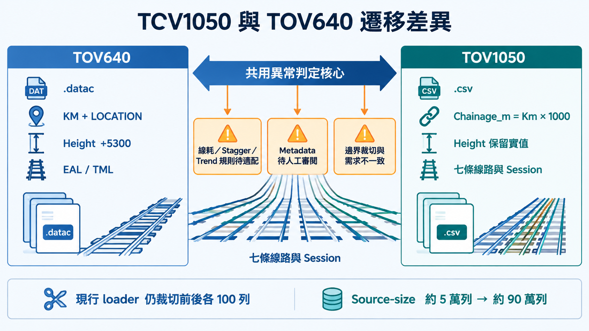

## 2. 程式架構與資料流

[完整 PNG](02-architecture-data-flow-v2.png) · [提示詞](prompts/02-architecture-data-flow-v2.txt)

「完整清洗資料」指 ingestion 保留下來的全部有效列，不表示原始 CSV 完全未裁切。Detector 與 raw export 不可取自圖表降採樣 payload；source_id 用來維持分析來源隔離。

來源：`PRODUCT.md`、`backend/app/api/endpoints/analysis.py`、`backend/app/core/chart_sampling.py`。

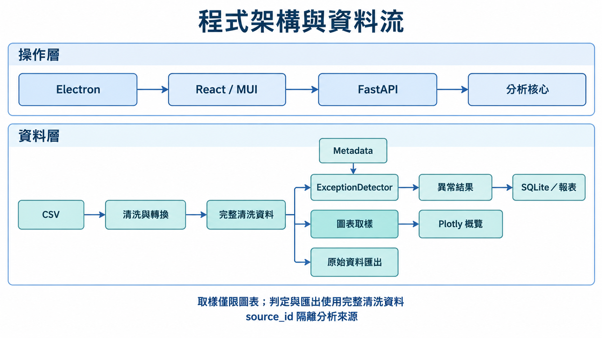

## 3. 核心模組：從量測到維護判斷

[完整 PNG](03-key-modules-v2.png) · [提示詞](prompts/03-key-modules-v2.txt)

功能存在於 repository 不表示已完成所有 TOV1050 line/session 的適配。Calculation 使用的 legacy 規則與 config 需要單獨核實。

來源：`backend/app/core/tov1050_data_ingestion.py`、`backend/app/core/analyzers.py`、`backend/app/core/repeated_finder.py`、`docs/architecture.md`。

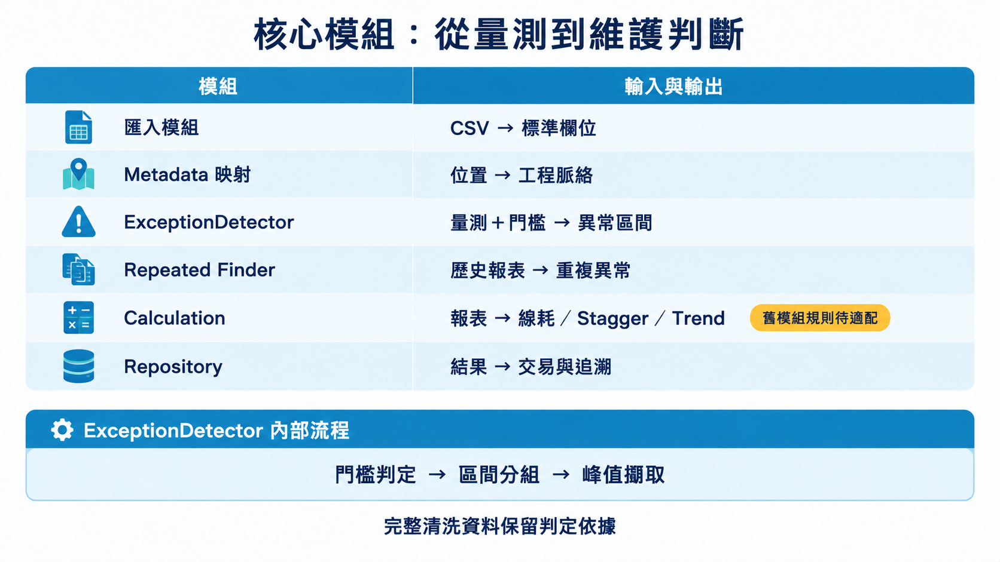

## 4. Metadata 審閱與核准流程

[完整 PNG](04-metadata-review.png) · [提示詞](prompts/04-metadata-review.txt)

圖中說明審閱流程，不宣稱當前使用者修改的 workbook 已驗證。合法 tension-length overlap、landmark 與 physical bracket identity 應分開處理。導入需 provenance、digest 與人工核准。

來源：`docs/requests/2026-09-07-tov1050-correctness-session-export-metadata.md`、`docs/audits/2026-09-02-tov1050-metadata-review-summary.md`。

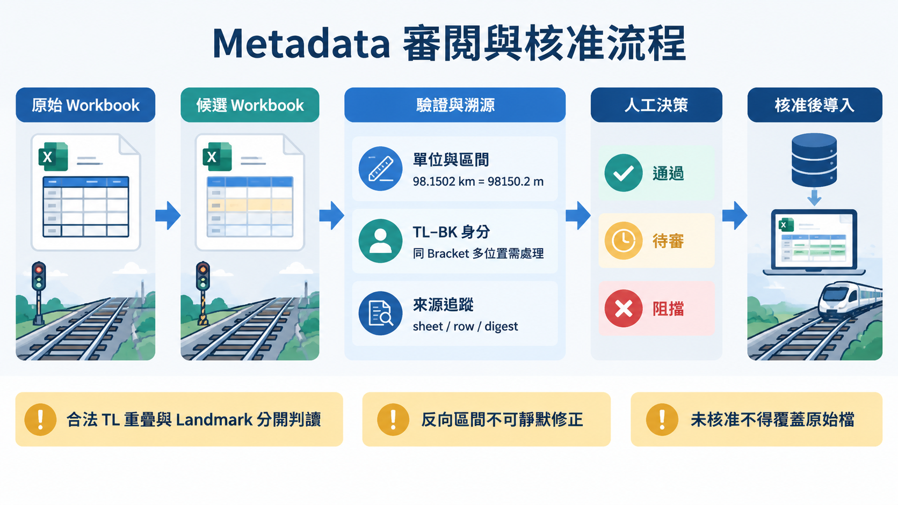

## 5. 開發計畫與後續階段

[完整 PNG](05-development-plan.png) · [提示詞](prompts/05-development-plan.txt)

這是根據現有文件與本次發現整理的建議次序，沒有交付日期或完成百分比。Linear MCP 未掛載，沒有建立／更新 issue。

來源：`docs/development-plan.md`、`docs/requests/2026-09-07-tov1050-correctness-session-export-metadata.md`。

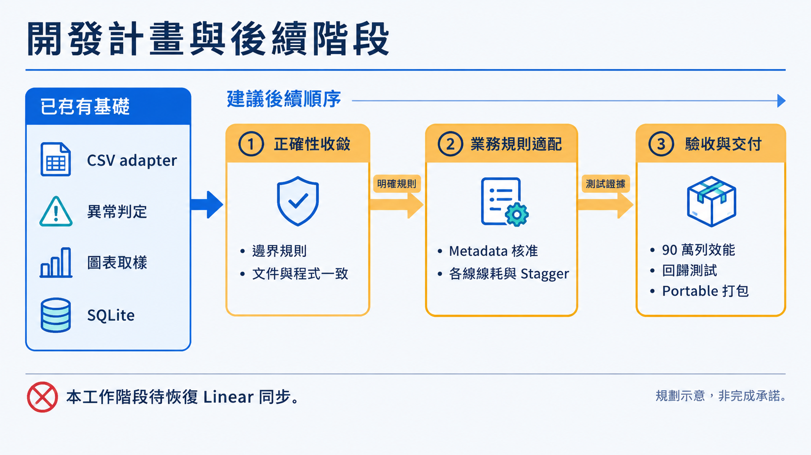

## 6. UI 設計：支援實際審閱工作

[完整 PNG](06-ui-design-v2.png) · [提示詞](prompts/06-ui-design-v2.txt)

這是生成的 UI 工作流程解說圖，不是截圖，也不表示前端已修改。沿用既有 MUI/Plotly、高密度工作台的設計語彙；表格／圖線都是示意。

來源：`PRODUCT.md`、`DESIGN.md`、`frontend/src/App.tsx`、`frontend/src/views/ExceptionGeneratorView.tsx`。

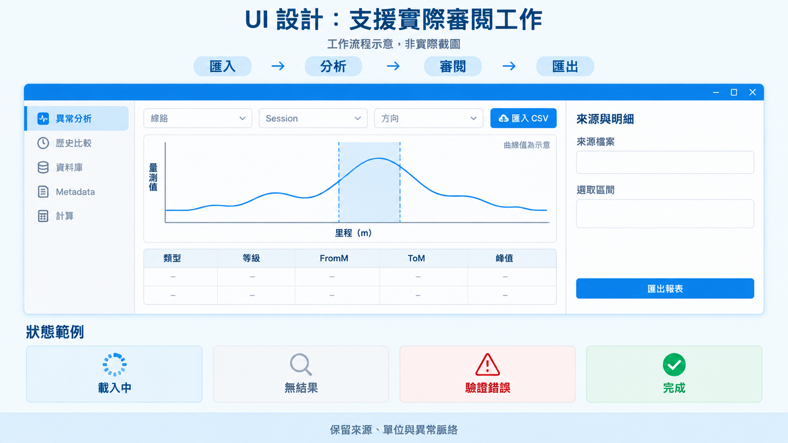

## 7. 門檻判定 Threshold Determination

[完整 PNG](07-threshold-determination-v2.png) · [提示詞](prompts/07-threshold-determination-v2.txt)

先依 Exc Type、Track Type 篩選，再依 Class lookup。未定義的 Class 可用 both；已定義但值 NaN 必須保留 NaN。缺失 level 不參與分類。圖沒有給出跨線通用數值門檻。

來源：`backend/app/core/analyzers.py:327`、`backend/app/core/tov1050_metadata.py`。

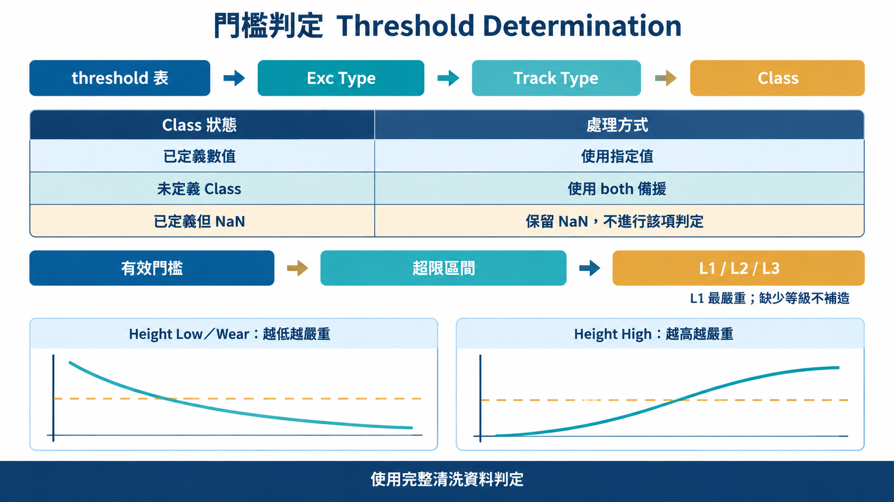

## 8. Chain Rule：歷史連續比對

[完整 PNG](08-history-chain-rule-v3.png) · [提示詞](prompts/08-history-chain-rule-v3.txt)

每輪都保留最新 master 的 FromM、ToM、peak，與下一份舊報表比較；不是把每輪的交集逐步縮小成累積幾何。只保留連續命中的 master，並附 Previous ID 與幾何。同一 latest ID 多個匹配保留第一筆。

來源：`backend/app/core/repeated_finder.py:38`、`backend/app/api/endpoints/analysis.py`。

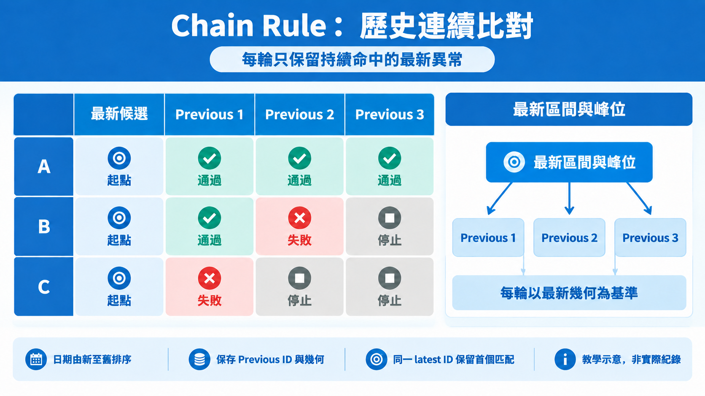

## 9. 匹配條件：Valid Match、Gap、Peak Shift

[完整 PNG](09-matching-criteria-v2.png) · [提示詞](prompts/09-matching-criteria-v2.txt)

成立條件：相同 exception type；i_start=max(兩個 FromM)，i_end=min(兩個 ToM)；i_start<=i_end，且兩個 peak 均在閉區間內。Gap 與 Peak Shift 是教學診斷分類，不是宣稱 API 另有這兩個回傳欄位。端點接觸且兩峰都等於該端點，依程式也能通過。

來源：`backend/app/core/repeated_finder.py:38`。

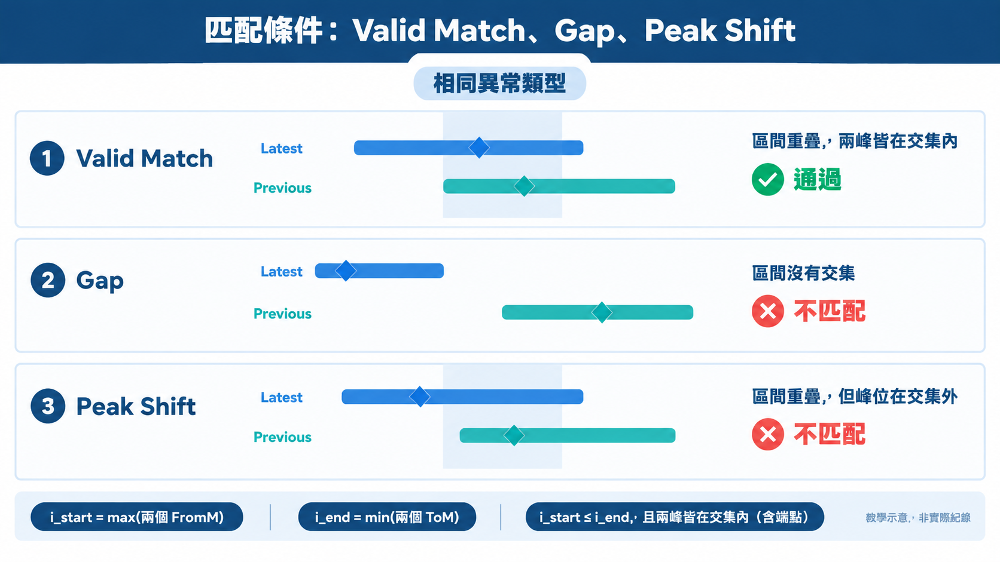

## 10. 線耗計算邏輯

[完整 PNG](10-wire-wear-logic-v2.png) · [提示詞](prompts/10-wire-wear-logic-v2.txt)

r=mean_remaining 是剩餘厚度，不是半徑。R=6.6，名義截面=120.0；acos 輸入 clamp[-1,1]，百分比 clamp[0,100] 並 round 2dp。r=0 特例回傳 0%，ValueError/ZeroDivisionError 回傳 100%；不能將特殊回傳當成物理意義。TOV1050 各線線材參數需業務核定。

來源：`backend/app/core/calculation/wear_calculator.py:14`、`backend/app/core/calculation/wear_calculator.py:34`、`docs/architecture.md`。

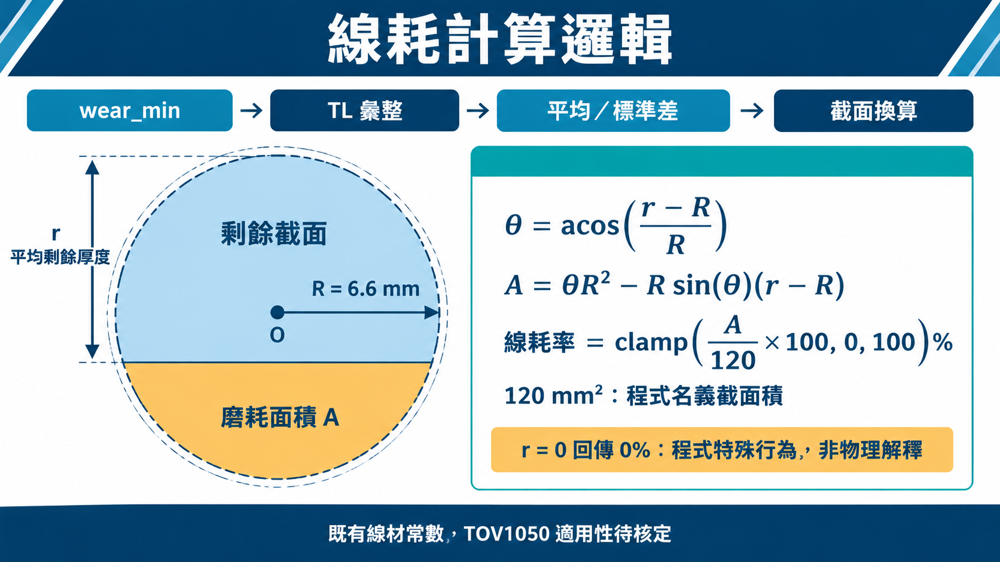

## 11. Stagger 演算法解說

[完整 PNG](11-stagger-algorithm-v2.png) · [提示詞](prompts/11-stagger-algorithm-v2.txt)

公式來自 stagger_formula.py：B=0.6137×0.8×1.08×(34.3×k_eq)^2×0.0132×span^2/(32×tension)。P=abs((stg_x+stg_i)/2)，S=abs(stg_x-stg_i)，B>0 時 E=S²/(16B)，否則 E=0。allowable=505-(B+E)-height_correction；S>=4B 為 short-circuit pass。缺必要支撐點回 n/a 與 partial trace；預設 metadata workbook 仍只列 EAL/TML。

來源：`backend/app/core/calculation/stagger_formula.py`、`backend/app/core/calculation/stagger_metadata.py`、`docs/architecture.md`。

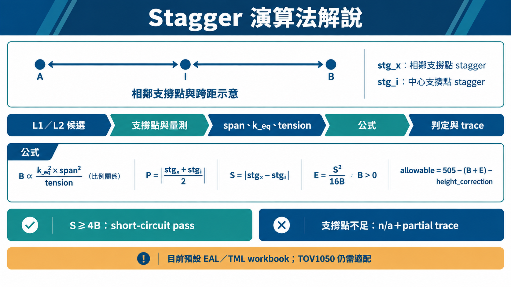

## 12. 趨勢分析：兩種不同用途

[完整 PNG](12-trend-analysis-v3.png) · [提示詞](prompts/12-trend-analysis-v3.txt)

L2 trend 只選最新 L2 且 action 空白；若提供 repeated report，只保留其 ID，不回退全候選。按每日期的異常區間最小 wear_min 線性擬合。判定使用最新日期 fitted value，不是下一期預測。TL 長期 trend 同日先平均，再以 elapsed_days/365.2425 回歸；mm/year=-slope，少於兩日期或非正磨耗率分開回報。舊 L2 常數 10.2/0.2 不等同核准的 TOV1050 門檻。

來源：`backend/app/core/calculation/trend_analyzer.py`、`backend/app/core/calculation/wear_cycle_analytics.py:77`。

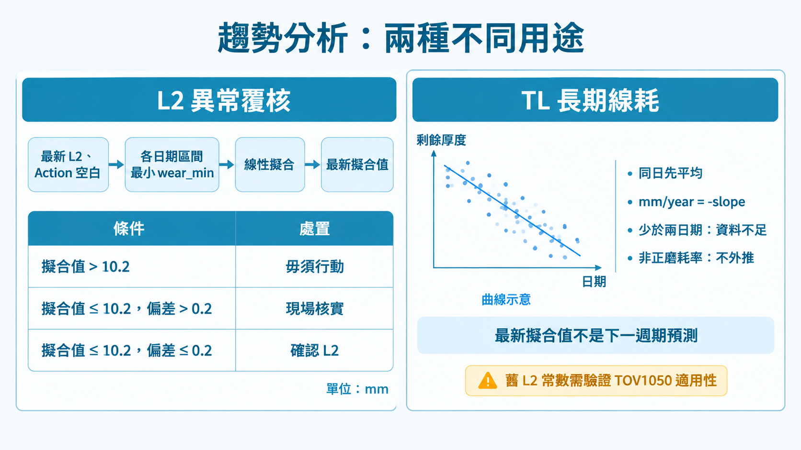

## 13. SQLite 資料庫管理

[完整 PNG](13-sqlite-management.png) · [提示詞](prompts/13-sqlite-management.txt)

DatabaseManager 使用 thread-local connection、foreign keys、WAL；一般 context 正常結束 commit，出錯 rollback。Preview/digest/version/BEGIN IMMEDIATE 為 normalized wear 保存／同步契約，不是所有 CRUD 一律如此。資料表群組是概念圖，不是完整 ERD。

來源：`backend/app/core/database.py`、`backend/app/core/calculation/wear_cycle_repository.py`、`docs/architecture.md`。

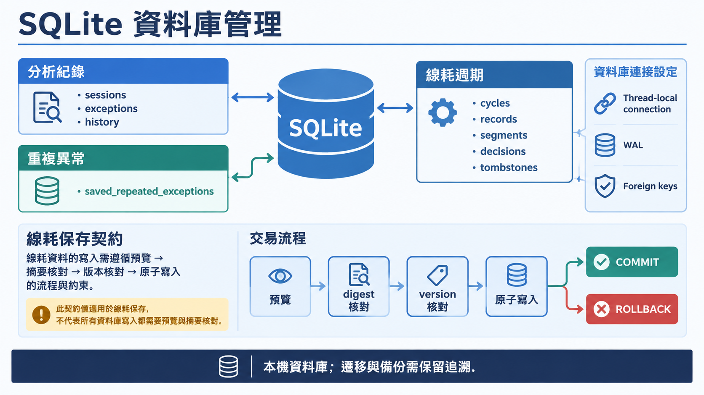

